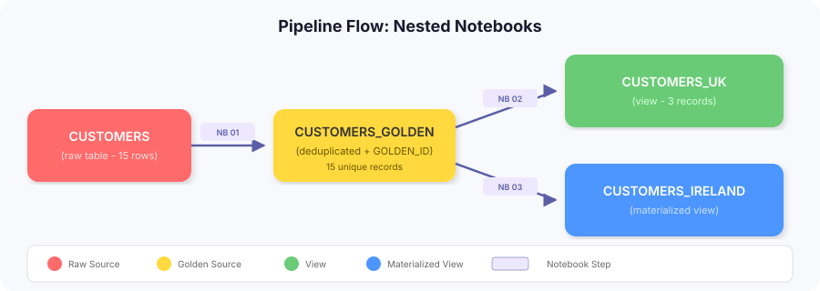
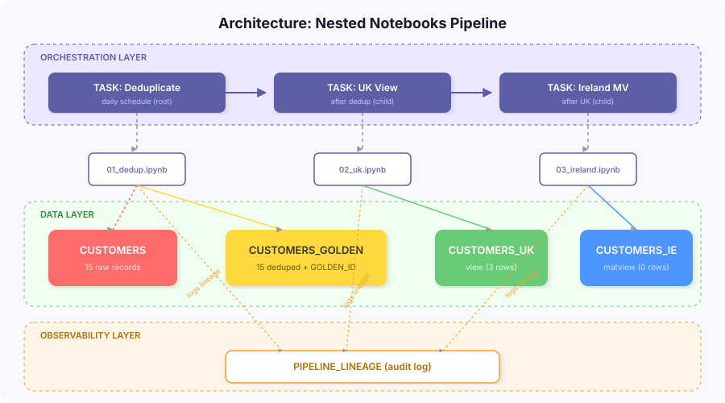
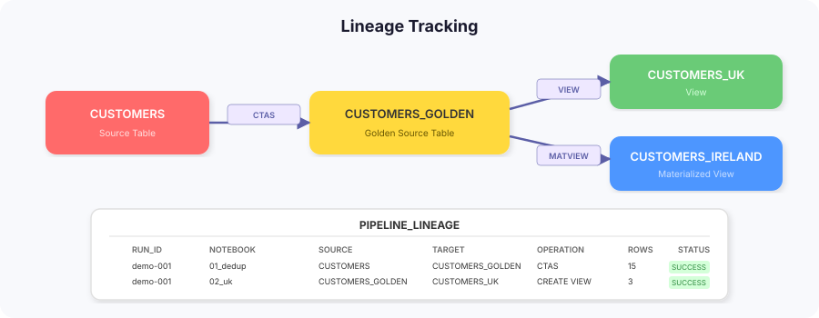
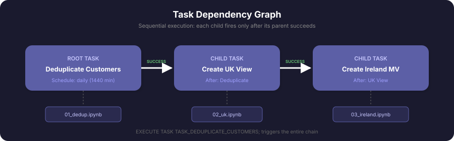
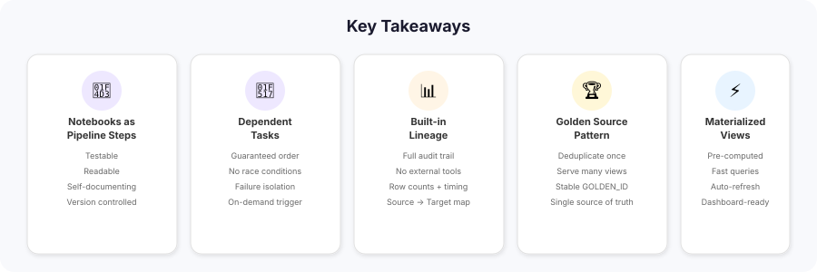

# Nested Notebooks Demo Script

## Overview

This demo shows how to build a **data quality pipeline using nested Snowflake Notebooks** orchestrated by a dependent task graph, with full **lineage tracking** at every step.

**Pipeline:**



---

## Talking Points

### Architecture



---

### 1. The Problem (30 seconds)

> "Customer data often has duplicates — same person, multiple records, slightly different emails or entry dates. Before we can build reliable regional views, we need a single golden source of truth."

- Show `LANSDOWNEPARTNERS_DB.CORE.CUSTOMERS` table
- Point out that records might share the same email

```sql
SELECT EMAIL, COUNT(*) AS cnt
FROM LANSDOWNEPARTNERS_DB.CORE.CUSTOMERS
WHERE EMAIL IS NOT NULL
GROUP BY EMAIL
ORDER BY cnt DESC;
```

---

### 2. The Solution: Notebook-Driven Pipeline (1 minute)

> "We've built three notebooks that form a pipeline. Each one does one job, logs its lineage, and the whole thing is orchestrated by Snowflake Tasks."

Open each notebook briefly:

| Notebook | What it does |
|----------|-------------|
| `01_deduplicate_customers` | Groups by email, assigns a `GOLDEN_ID`, picks the most recent record as master |
| `02_customers_uk_view` | Creates a view of UK master records from the golden table |
| `03_customers_ireland_matview` | Creates a materialized view of Ireland master records |

Key design decisions to call out:
- **DENSE_RANK** over email gives a stable golden ID
- **IS_MASTER_RECORD** flag keeps all records but marks the canonical one
- Views sit on top of the golden table — no data duplication

---

### 3. Lineage Tracking (1 minute)

> "Every notebook logs its source, target, operation, and row count to a lineage table. This gives us an auditable record of what happened, when, and where the data flowed."

```sql
SELECT SOURCE_OBJECT AS "FROM", TARGET_OBJECT AS "TO", 
       OPERATION, NOTEBOOK_NAME, ROW_COUNT, EXECUTION_TIMESTAMP
FROM LANSDOWNEPARTNERS_DB.CORE.PIPELINE_LINEAGE
ORDER BY EXECUTION_TIMESTAMP DESC;
```



> "This is custom lineage we control — complementing Snowflake's built-in ACCESS_HISTORY and object dependencies. It captures the *notebook* that created each object and the row counts at execution time."

---

### 4. Task Orchestration (1 minute)

> "These notebooks don't just run in isolation. They're wired into a dependent task graph."

```sql
SHOW TASKS IN SCHEMA LANSDOWNEPARTNERS_DB.CORE;
```



> "The root task runs daily. Each child only fires after its predecessor succeeds. If dedup fails, the downstream views don't get stale data — they simply don't run."

Trigger a manual run:

```sql
EXECUTE TASK LANSDOWNEPARTNERS_DB.CORE.TASK_DEDUPLICATE_CUSTOMERS;
```

Check execution:

```sql
SELECT name, state, scheduled_time, completed_time
FROM TABLE(INFORMATION_SCHEMA.TASK_HISTORY(
    SCHEDULED_TIME_RANGE_START => DATEADD('minute', -5, CURRENT_TIMESTAMP()),
    RESULT_LIMIT => 10
))
WHERE name LIKE 'TASK_CUSTOMERS%' OR name = 'TASK_DEDUPLICATE_CUSTOMERS'
ORDER BY scheduled_time DESC;
```

---

### 5. Results (30 seconds)

> "Let's look at what we've built."

```sql
-- Golden source: all records with master flag
SELECT * FROM LANSDOWNEPARTNERS_DB.CORE.CUSTOMERS_GOLDEN LIMIT 10;

-- UK customers only (master records)
SELECT * FROM LANSDOWNEPARTNERS_DB.CORE.CUSTOMERS_UK;

-- Ireland customers (materialized for fast access)
SELECT * FROM LANSDOWNEPARTNERS_DB.CORE.CUSTOMERS_IRELAND;
```

---

### 6. Why This Matters (30 seconds)

Wrap up with the key takeaways:



1. **Notebooks as pipeline steps** — each notebook is testable, readable, and self-documenting
2. **Dependent tasks** — guaranteed execution order, no race conditions
3. **Built-in lineage** — full audit trail of data flow without external tools
4. **Golden source pattern** — deduplicate once, serve many views downstream
5. **Materialized views** — Ireland data is pre-computed for fast dashboard queries

> "This pattern scales to any number of downstream consumers. Add a new country? Add a notebook and a task — the lineage tracks it automatically."

---

## Quick Reference

| Object | Type | Purpose |
|--------|------|---------|
| `CUSTOMERS` | Table | Raw source data |
| `CUSTOMERS_GOLDEN` | Table | Deduplicated with GOLDEN_ID |
| `CUSTOMERS_UK` | View | UK master records |
| `CUSTOMERS_IRELAND` | Materialized View | Ireland master records |
| `PIPELINE_LINEAGE` | Table | Execution lineage log |
| `TASK_DEDUPLICATE_CUSTOMERS` | Task (root) | Runs notebook 1 daily |
| `TASK_CUSTOMERS_UK_VIEW` | Task (child) | Runs notebook 2 after root |
| `TASK_CUSTOMERS_IRELAND_MATVIEW` | Task (child) | Runs notebook 3 after UK |

---

## Cleanup

```sql
ALTER TASK LANSDOWNEPARTNERS_DB.CORE.TASK_DEDUPLICATE_CUSTOMERS SUSPEND;
DROP TASK IF EXISTS LANSDOWNEPARTNERS_DB.CORE.TASK_CUSTOMERS_IRELAND_MATVIEW;
DROP TASK IF EXISTS LANSDOWNEPARTNERS_DB.CORE.TASK_CUSTOMERS_UK_VIEW;
DROP TASK IF EXISTS LANSDOWNEPARTNERS_DB.CORE.TASK_DEDUPLICATE_CUSTOMERS;
DROP MATERIALIZED VIEW IF EXISTS LANSDOWNEPARTNERS_DB.CORE.CUSTOMERS_IRELAND;
DROP VIEW IF EXISTS LANSDOWNEPARTNERS_DB.CORE.CUSTOMERS_UK;
DROP TABLE IF EXISTS LANSDOWNEPARTNERS_DB.CORE.CUSTOMERS_GOLDEN;
DROP TABLE IF EXISTS LANSDOWNEPARTNERS_DB.CORE.PIPELINE_LINEAGE;
```
